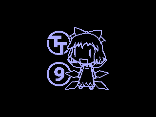

<!---

This file is used to generate your project datasheet. Please fill in the information below and delete any unused
sections.

You can also include images in this folder and reference them in the markdown. Each image must be less than
512 kb in size, and the combined size of all images must be less than 1 MB.
-->

## How it works

Displays THE STRONGEST bouncing logo on the screen, with animated color gradient.

## How to test

Connect to a VGA monitor. Set the following inputs to configure the design:

- `tile` (ui_in[0]) to repeat the logo and tile it across the screen,
- `solid_color` (ui_in[1]) to use a solid color instead of an animated gradient.

If you have a Gamepad Pmod connected, you can also use the following controls:

- Start button: start/pause bouncing
- Left/right/up/down: change the bouncing direction (if bouncing) or move the logo around the screen (if paused)

## External hardware

- [Tiny VGA Pmod](https://github.com/mole99/tiny-vga)
- Optional: [Gamepad Pmod](https://github.com/psychogenic/gamepad-pmod)
